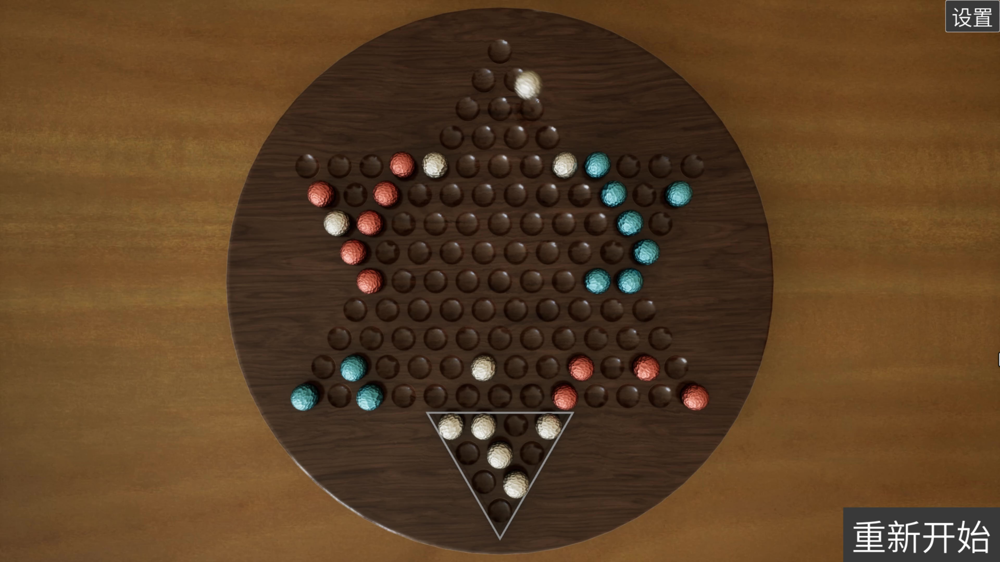
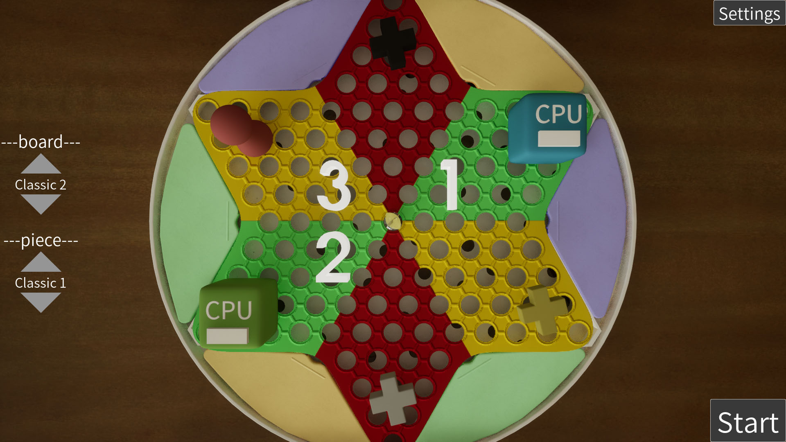
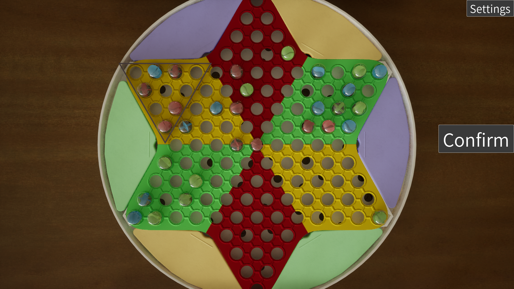
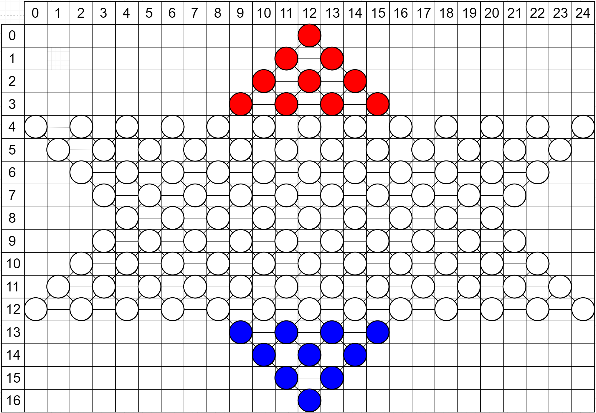

# Chinese Checkers UE 虚幻跳棋

A Chinese checkers game made with UE 5.1.

基于虚幻引擎 5.1的跳棋游戏。

Implement AI using simple BFS and pruning.

使用简单的广度优先搜索和剪枝实现AI.

Only support local play.

仅支持本地对战。

**[Game Download 游戏下载](https://mariocanfly.itch.io/jingges-collection-of-chess-games)**

# Details 细节

This project can only be opened using UE5.1, and opening it using UE5.4 will result in an error.

该项目只能使用UE5.1打开，使用UE5.4打开会报错。

The board grid is based on this picture:

棋盘网格基于以下图片：

# License

This project is released under MIT License.